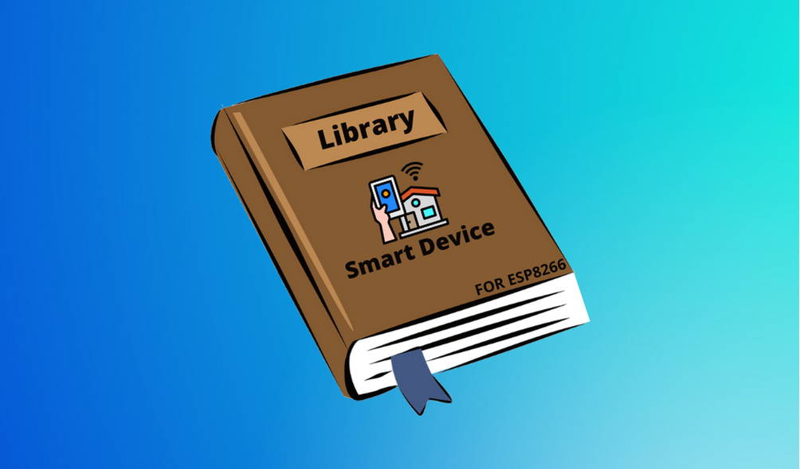

---

# Smart Device Library

---

## 🎯 Objective

- This library is part of Smart Device Project;

- Is mean to be used with [Smart Device App](https://github.com/marceloams/smart-device-app) and [Smart Device API](https://hub.docker.com/repository/docker/marceloams/smart-devices-api);

- Developed for ESP8266 microcontroller.

---

## 📚 Dependencies 

#### This library rely on the following libraries:

- <a href="https://github.com/esp8266/Arduino/tree/master/libraries/ESP8266WiFi" target="_blank">ESP8266WiFi</a>;
- <a href="https://github.com/esp8266/Arduino/blob/master/libraries/ESP8266WiFi/src/WiFiClient.h" target="_blank">WiFiClient</a>;
- <a href="https://github.com/esp8266/Arduino/tree/master/libraries/ESP8266HTTPClient" target="_blank">ESP8266HTTPClient</a>.

---

## 📁 Repository structure

- <a href="https://github.com/marceloams/smart-device-library" target="_blank">Main Code</a>;
- <a href="https://github.com/marceloams/smart-device-library/tree/master/examples" target="_blank">Examples</a>.

---

## ⚡ Example

### [DHT11 (Temperature and humidity sensor)](https://github.com/marceloams/smart-device-library/blob/master/examples/PresenceSensor/PresenceSensor.ino)

```
#include "DHT.h"
#include "ESP8266WiFi.h"
#include "WiFiClient.h"
#include "ESP8266HTTPClient.h"
#include "SmartDevices.h"

#define DHTPIN D1     
#define DHTTYPE DHT11  
DHT dht(DHTPIN, DHTTYPE);
int h = 0;
float t = 0;

const char* ssid = ""; //Enter your WIFI ssid
const char* password = ""; //Enter your WIFI password
String server_url = "";// Enter the API endpoint without '/' at the end
String devicesIds[] = {"id1", "id2"}; //Enter your device Id

int size;

// Set up the client objet
WiFiClient client;
HTTPClient http;

SmartDevices smartDevices(server_url, client, http);

void readDht11(){
    h = dht.readHumidity();
    t = dht.readTemperature();

    if (isnan(h) || isnan(t)) {
        Serial.println(F("Failed to read from DHT sensor!"));
        return;
    }

    Serial.print("Humidity = ");
    Serial.print(h);
    Serial.print("%  ");
    Serial.print("Temperature = ");
    Serial.print(t); 
    Serial.println("C  ");
}

void setup() {
    delay(3000);
    Serial.begin(115200);
    dht.begin();
    WiFi.begin(ssid, password);
    while (WiFi.status() != WL_CONNECTED) {
        delay(500);
        Serial.print(".");
    }
    Serial.println("WiFi connected");

    smartDevices.initConnection(devicesIds, 1);

    delay(1000);
}

void loop() {
    readDht11();

    String measures[] = {String(h),String(t)};
    size = sizeof(measures) / sizeof(String);

    smartDevices.sendMeasures(devicesIds[0], measures, size);

    delay(5000);
}
```

### Other Examples

  - [HC-SR501 PIR (presence sensor)](https://github.com/marceloams/smart-device-library/blob/master/examples/TemperatureSensor/TemperatureSensor.ino);
  - [MQ-9 (gas sensor)](https://github.com/marceloams/smart-device-library/blob/master/examples/GasSensor/GasSensor.ino);
  - [MultiSensor (DHT11, HC-SR501 PIR and MQ-9)](https://github.com/marceloams/smart-device-library/blob/master/examples/MultiSensor/MultiSensor.ino).
 
---
 
✔️ If you've followed the steps and were successful, it's a sign that it worked!
<br>
<br>

<br>
<br>
❌ If any of the steps didn't work, something wrong isn't right! (Make an issue)
<br>
<br>


---

## 🔨 Contribution

### Step 1

- **Option 1**
    - 🍴 Fork this repository!

- **Option 2**
    - 👯 Clone to your machine.

### Step 2

- **Code it!** 👨‍💻👩‍💻

### Step 3

- 🔃 Create a pull request.

 ---
 
 ## 👨‍💻 Authors

| **Marcelo Amorim** | **Caio Souza** |
| :---: | :---: |
| [](https://github.com/marceloams) | [](https://github.com/CaioHpSouza) |

---
 
 ## ©️ License

[](http://badges.mit-license.org)

- **[MIT license](http://opensource.org/licenses/mit-license.php)**
- Copyright 2021 © <a href="https://github.com/marceloams/smart-device-library" target="_blank">SmartDeviceProductions</a>.

---